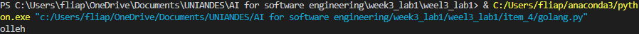

# Translation of Golang Snippet to Python

## Original Snippet (Golang)
```go
package main

import "fmt"

func ReverseString(s string) string {
    r := []rune(s)
    for i, j := 0, len(r)-1; i < j; i, j = i+1, j-1 {
        r[i], r[j] = r[j], r[i]
    }
    return string(r)
}

Prompt Used
"Translate the following Golang snippet to Python, maintaining the same functionality of reversing a string:"

Translated Code (Python)

def reverse_string(s):
    return s[::-1]

Explanation of Changes

The function name is changed from ReverseString to reverse_string to follow Python naming conventions (snake_case).
In Python, we can reverse a string using slicing with a step of -1, which is more idiomatic and efficient than the character-by-character swap used in the Golang version.
The rune type in Golang is not necessary in Python, as Python strings are already Unicode by default.

Adjustments Made
No additional adjustments were necessary after the initial translation.

