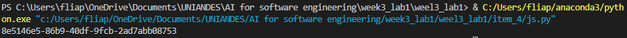

# Translation of JavaScript/NodeJS Snippet to Python

## Original Snippet (JavaScript/NodeJS)
```javascript
const generateUUID = () =>
  ([1e7] + -1e3 + -4e3 + -8e3 + -1e11).replace(/[018]/g, c =>
    (
      c ^
      (crypto.getRandomValues(new Uint8Array(1))[0] & (15 >> (c / 4)))
    ).toString(16)
  );


  Prompt Used
"Translate the following JavaScript/NodeJS snippet to Python, ensuring it maintains the same functionality of generating a UUID:"

Translated Code (Python)

import uuid

def generate_uuid():
    return str(uuid.uuid4())


Explanation of Changes
The JavaScript snippet implements a custom UUID generation algorithm. However, Python has a built-in uuid module that provides a more standard and efficient way to generate UUIDs. The uuid4() function generates a random UUID, which is equivalent to the original function's purpose.
Adjustments Made
Instead of directly translating the algorithm, we opted for using Python's built-in UUID generation to ensure better compatibility and maintainability.
Execution Result

