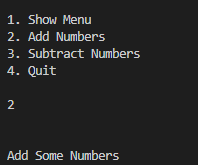
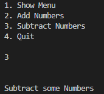

# Traducción de Snippet Ruby a Python

## Snippet Original (Ruby)
```ruby
def menu ()
    menu_string = "1. Show Menu\n"
    menu_string += "2. Add Numbers\n"
    menu_string += "3. Subtract Numbers\n"
    menu_string += "4. Quit\n"
    return menu_string
end

# Main Program Starts

system "clear" # Clear the screen
choice = 0

while choice < 4 do
    puts menu()
    choice = gets.to_i

    if choice == 1
        system "clear"
    elsif choice == 2
        puts "\n\nAdd Some Numbers\n\n"
    elsif choice == 3
        puts "\n\nSubtract some Numbers\n\n"
    else
    end
end


Prompt used
"Traduce el siguiente snippet de Ruby a Python: [snippet de Ruby]"

Translated code (Python)

import os

def menu():
    menu_string = "1. Show Menu\n"
    menu_string += "2. Add Numbers\n"
    menu_string += "3. Subtract Numbers\n"
    menu_string += "4. Quit\n"
    return menu_string

# Main Program Starts

os.system('cls' if os.name == 'nt' else 'clear')  # Clear the screen
choice = 0

while choice < 4:
    print(menu())
    choice = int(input())

    if choice == 1:
        os.system('cls' if os.name == 'nt' else 'clear')
    elif choice == 2:
        print("\n\nAdd Some Numbers\n\n")
    elif choice == 3:
        print("\n\nSubtract some Numbers\n\n")
    else:
        pass

Result


